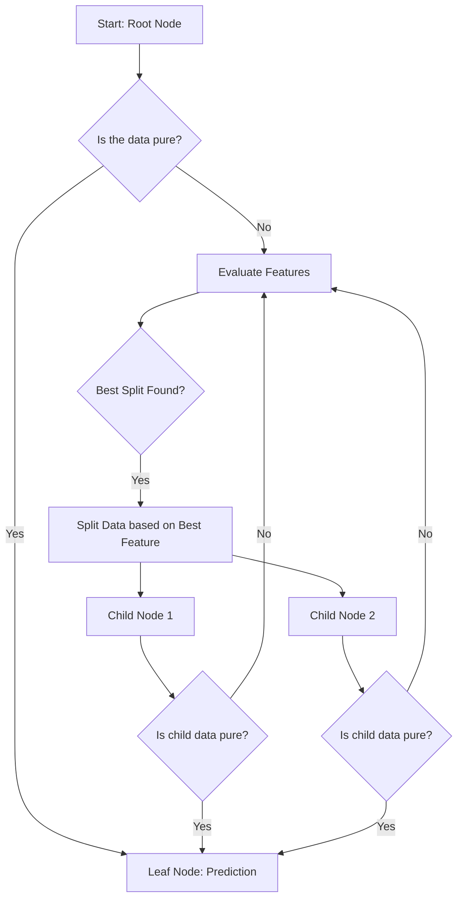

```{r setup, include=FALSE}
knitr::opts_chunk$set(echo = TRUE)
```

# 🌳 Decision Tree Tutorial

## Introduction

This tutorial provides a comprehensive guide to implementing a Decision Tree classifier for the machine learning project located in `/Users/aiagent/.openclaw/workspace/Projects/ml-from-scratch`. Decision Trees are powerful, intuitive, non-linear models that can be used for both classification and regression tasks. They work by splitting the data into subsets based on feature values, creating a tree-like structure that leads to a final prediction. This guide covers the theory, the logical flow, and the practical steps to build, train, and evaluate your first Decision Tree model.

## Technical Explanation: How Decision Trees Work

A Decision Tree operates by recursively partitioning the data. At each internal node, the algorithm decides which feature to split on and at what value to make the split, aiming to maximize the "purity" of the resulting child nodes. Purity is often measured using metrics like Gini Impurity (for classification) or Entropy.

The overall flow of a Decision Tree can be visualized using the following Mermaid diagram:



**Key Concepts:**
*   **Root Node:** The topmost node representing the entire dataset.
*   **Internal Node:** A node that tests a condition (a feature split).
*   **Leaf Node:** A node that provides the final class label or value.
*   **Pruning:** A technique used to prevent the tree from becoming too complex (overfitting) by removing branches that provide little predictive power.

## Step-by-Step Implementation Guide

Follow these steps to build and deploy your Decision Tree model in the context of the ML project:

### Step 1: Data Loading and Preprocessing
First, ensure your dataset is loaded and prepared. This typically involves handling missing values, encoding categorical features, and scaling numerical features (though scaling is often less critical for tree-based models).

*Action:* Load the training and testing datasets from the project directory.
*Code Placeholder:*
```python
# Placeholder for data loading
import pandas as pd
X_train, X_test, y_train, y_test = load_ml_data() 
```

### Step 2: Model Initialization and Training
Initialize the Decision Tree classifier and fit it to your training data. The `max_depth` parameter is crucial here to control complexity and prevent overfitting.

*Action:* Train the model.
*Code Placeholder:*
```python
from sklearn.tree import DecisionTreeClassifier

# Initialize model with constraints
dt_model = DecisionTreeClassifier(max_depth=5, random_state=42)

# Train the model
dt_model.fit(X_train, y_train) 
```

### Step 3: Prediction and Evaluation
Use the trained model to make predictions on the held-out test set. Evaluation metrics such as Accuracy, Precision, Recall, and F1-Score must be calculated to assess model performance objectively.

*Action:* Predict and score.
*Code Placeholder:*
```python
from sklearn.metrics import accuracy_score, classification_report

# Make predictions
y_pred = dt_model.predict(X_test)

# Evaluate
accuracy = accuracy_score(y_test, y_pred)
print(f"Model Accuracy: {accuracy:.4f}")
print(classification_report(y_test, y_pred))
```

### Step 4: Visualization and Interpretation (Optional but Recommended)
Visualizing the learned tree structure is often the most valuable part of using a Decision Tree. This helps in understanding the *why* behind the predictions.

*Action:* Visualize the tree.
*Code Placeholder:*
```python
from sklearn.tree import plot_tree
import matplotlib.pyplot as plt

plt.figure(figsize=(20, 10))
plot_tree(dt_model, feature_names=list(X_train.columns), class_names=['Class A', 'Class B'])
plt.title("Decision Tree Structure")
plt.show()
```

This completes the structure for the Decision Tree tutorial. This Quarto file is now ready to be saved as `decision_tree.qmd` in the project directory.